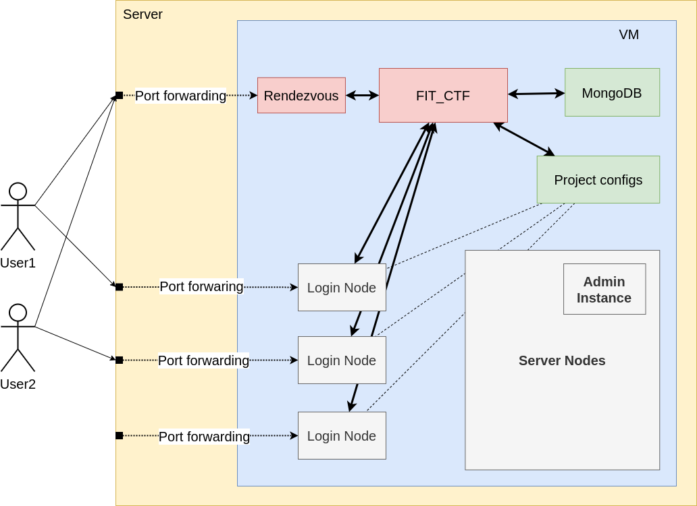

# CTF Framework at FIT BUT

This is a basic container-oriented CTF framework built on top of Podman and Podman-Compose. **FIT_CTF** is a tool for managing projects/competitions and users. This program consists of two parts: **CLI** tool that communicates with the back-end (logic) and the database, and **Rendezvous** tool which serves as a starting point for the users (for user authentication and starting login nodes).

## Requirements
In order to run this tool there are a few tool that needs to be installed:
- Python 3.9+
- Poetry (optional but recommended)
- Podman
- Podman-Compose

## Installation and Running the tool
Pull this repository and install dependencies using `poetry`.
```sh
git clone https://github.com/hungdojan/FIT_CTF.git FIT_CTF
cd FIT_CTF
poetry install --only main
```

Before running the tool a database must be setup up and running. First create a `.env` file containing DB URL for the tool to connect to. An example `.env` file can be found in `./config/setup/env_example`. Feel free to change `DB_USERNAME`, `DB_PASSWORD`, or `DB_NAME`. Once the `.env` file is created use `manage_db.sh` script to start the database.

```sh
cp config/setup/env_example .env
./manage_db.sh start
```

Use `poetry` to run both tools.
```sh
# run CLI tool
poetry run ctf_backend <options>

# run Rendezvous tool
poetry run ctf_rendezvous
```

## Basic control
Use the CLI tool to setup project/competition, create users, enroll users, create modules, compile compose files, and more. Here is some a basic script that initialize a server, creates a new user and start the server instances.

```sh
# start DB
./manage_db.sh start

# a destination directory that will contain project data and user shadow files
mkdir data
mkdir -p data/shadow

# create a new project
poetry run ctf_backend project create \
    --name "demo_project" \
    --dest-dir ./data

# create a new user
poetry run ctf_backend user create \
    --username "user1" \
    --generate-password \
    --shadow-dir ./data/shadow/

# enroll user to the project
poetry run ctf_backend user enroll \
    --username "user1" \
    --project-name "demo_project"

# compile and start project (server nodes)
poetry run ctf_backend project server \
    --name "demo_project" \
    compile

poetry run ctf_backend project server \
    --name "demo_project" \
    start
```

User can then start his instance by running the **Rendezvous** tool.
```sh
poetry run ctf_rendezvous
```

Of course, the tool support a whole lot more. The full listing of commands can be found on the project's wiki page. Each command has a help command that displays command options and arguments. User `--help` option to display the usage messages.

```sh
$ poetry run ctf_backend --help
Usage: ctf_backend [OPTIONS] COMMAND [ARGS]...

Options:
  --help  Show this message and exit.

Commands:
  project  A command that manages projects.
  user     A command that manages users.

$ poetry run ctf_backend project --help
Usage: ctf_backend project [OPTIONS] COMMAND [ARGS]...

  A command that manages projects.

Options:
  --help  Show this message and exit.

Commands:
  active-users             Get list of active users that are enrolled to...
  create                   Create and initialize a new project.
  delete                   Delete existing project.
  export                   Export project configurations.
  flush-db                 Removes all inactive projects from the database.
  generate-firewall-rules  Generate port forwarding rules for `firewalld`.
  get-config               Return directory containing project...
  get-info                 Get project info.
  ls                       Display existing projects.
  module                   Manage modules.
  reserved-ports           Returns list of reserved ports.
  resources                Display project resources.
  server                   Manage project instances.
```

## Modules
By default, the server consists of only a single `admin` server node which is an [*Universal Base Image*](https://catalog.redhat.com/software/containers/ubi8/ubi/5c359854d70cc534b3a3784e?architecture=amd64&image=65cad35e0dac818fbda7a79c) provided by Red Hat. The version of the base image will be updated in the future version of this tool.

The tool supports creating and deploying new server nodes and login node instances. Run following commands to create a server or login node, resp.:
```sh
# create project module
poetry run ctf_backend project module \
    project --name "demo_project" \
    create --name "project_module1"

# compile project
project run ctf_backend project server \
    --name "demo_project" \
    compile
```

```sh
# create user module for the given project
poetry run ctf_backend project module \
    user --name "demo_project" \
    create --name "user_module1"

# assign module to the given user
poetry run ctf_backend user module add \
    --username "user1" \
    --project_name "demo_project" \
    --module_name "user_module1"
```

All project and user modules are generally generated in `./<path_to_project_config>/_modules/`. You are encouraged to edit `Containerfile` and `init_script.sh` to your needs.

More information can be found [here](https://hungdojan.github.io/FIT_CTF/click-commands.html).

## Deployment
It is expected that the CTF architecture will run inside a VM. The whole architecture can be seen in the following figure:



There are two things to set during the deployment:
1) Configure **SSHd** to allow user to connect to the *Rendezvous* and start their login
nodes.
2) Configure firewall and port forwarding to redirect all the communication to the VM.

#### Rendezvous setup
The first point requires a root permissions and is set up **inside the VM**. The idea here is to create an SSH access point with no authentication required but will only allow the *Rendezvous* script to be run. An example configuration template script is located in `./config/setup/99-ctf-rule.conf`. Fill the missing information in the template and copy it to `/etc/ssh/sshd_config.d/` directory. To apply changes, don't forget to run `sudo systemctl restart sshd`.

An example configuration for the user `TheUser`, using port 5555, and the repository located in `/home/TheUser/FIT_CTF`:

```
Port 22
Port 5555
Match User TheUser LocalPort 5555
    PermitEmptyPasswords yes
    ForceCommand cd /home/TheUser && poetry run ctf_rendezvous
```

Apply changes using following commands:
```sh
cp ./config/setup/99-ctf-rule.conf 99-ctf-rule.conf

# edit the new config file

sudo cp 99-ctf-rule.conf /etc/ssh/sshd_config.d/
# as written in /etc/ssh/sshd_config, if your system uses SELinux, you need to
# tell the it to also support a different port
semanage port -a -t ssh_port_t -p tcp 22
semanage port -a -t ssh_port_t -p tcp 5555
# validate sshd configurations
sudo sshd -t
# restart sshd and apply changes
sudo systemctl restart sshd
```

#### Port forwarding
The second task also requires a root permissions but is set up **outside the VM** (host machine). Generate port forwarding rules using `poetry run ctf_backend project generate-firewall-rules <project_name> -ip <dst_ip_addr>`. Then create a port forwarding rule for the *Rendezvous* SSH access point. Lastly, open selected ports to allow the communication to reach the VM.

The following example uses `firewalld` as a firewall application.

```sh
# open selected Rendezvous SSH port (in out case port 5555)
sudo firewall-cmd --add-port=5555/tcp

# port forward the Rendezvous SSH Port to the VM
# let's assume that the VM the IP assigned to the VM is 10.0.0.3
# forward from port 5555 to 5555
sudo firewall-cmd --zone=public \
    --add-forwarded-port=port=5555:proto=tcp:toport=5555:toaddr=10.0.0.3

# generate port forwarding script of all login nodes for the given project
poetry run ctf_backend project \
    generate-firewall-rules "demo_project" \
    -ip "10.0.0.3"

# manually open all login node ports as this feature was not implemented yet
# use the first command as a template
```

## Documentation
Tool's documentation will be periodically updated on the project's [documentation page](https://hungdojan.github.io/FIT_CTF/click-commands.html).

## Contribution and Feedback
Feel free to create new issues, suggest new features, or create a pull request.
