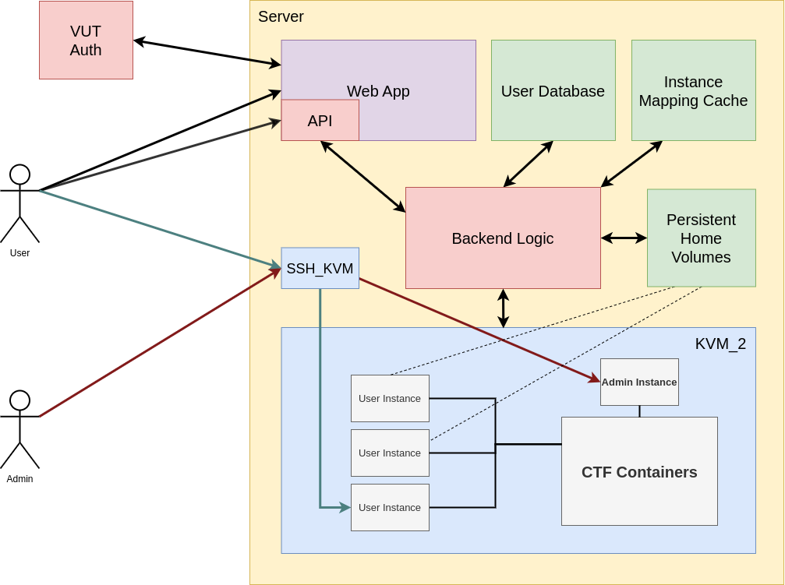

# CTF infrastructure description

## Architecture Schema

The whole application can be divided into 4 parts:
- **CTF infrastructure** - **KVM_2**'s content with **SSH_KVM** for safer ssh tunneling
- **CTF management app** - shown as **Backend Logic**
- **Web client** - shown as **Web App** and its **API**, used by the users
- **Databases** - **Mapping Cache**, **User Database** and **Persistent Home Volumes**, data that the application needs the store

## Actors
There are two roles: user and admin. **User** is 